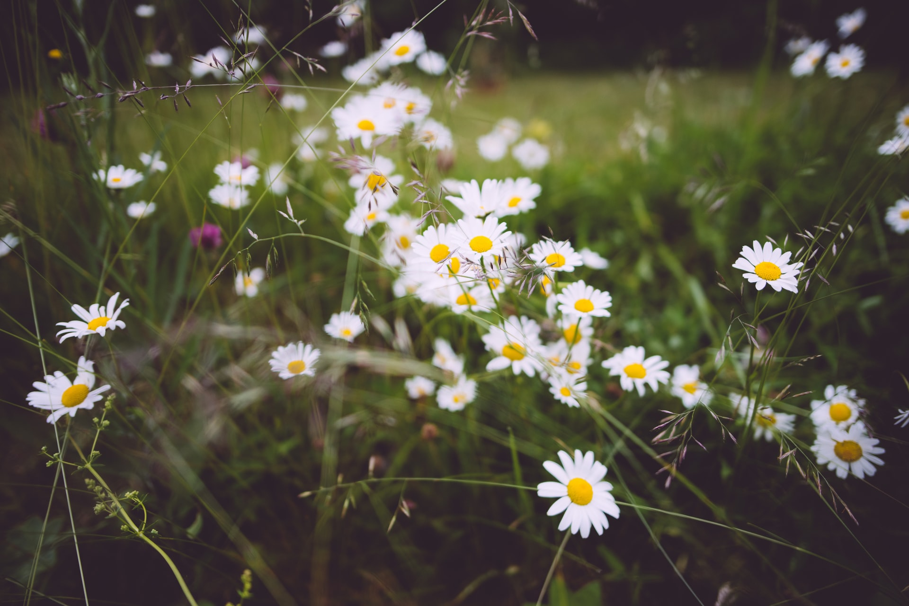

This summer I'm going to learn as much as I can to provide better service in the future. This website is going to undergo a ton of changes, since I want it to be a better platform for my thoughts, experiences and other things. 

Hopefully it will work out **and** I'll be a *real developer* at the end of it.

The things I want to improve:
- Pixel art;
- 3D Modeling;
- Webdev:
  - Social Network Integration;
  - Writing bots;
  - Web design;
  - Vue and React. 
  
I'm going to post most of the notable works on this website, I'm not sure in what form to post all of my works, but I'll figure it out.

And a random quote 🙂


> I'm in danger
> 
> -- <cite>Ralph Wiggum</cite>

And a bit of source code to test my dark theme,
PrismJS is awesome!

JavaScript
```js
console.log("Hello world adadsadadadasdasd")
```

TypeScript
```typescript
function fun(a:string): string {
  return a;
}
```

CSS
```css
.markdown {
  color: var(--primary-color);
}
```